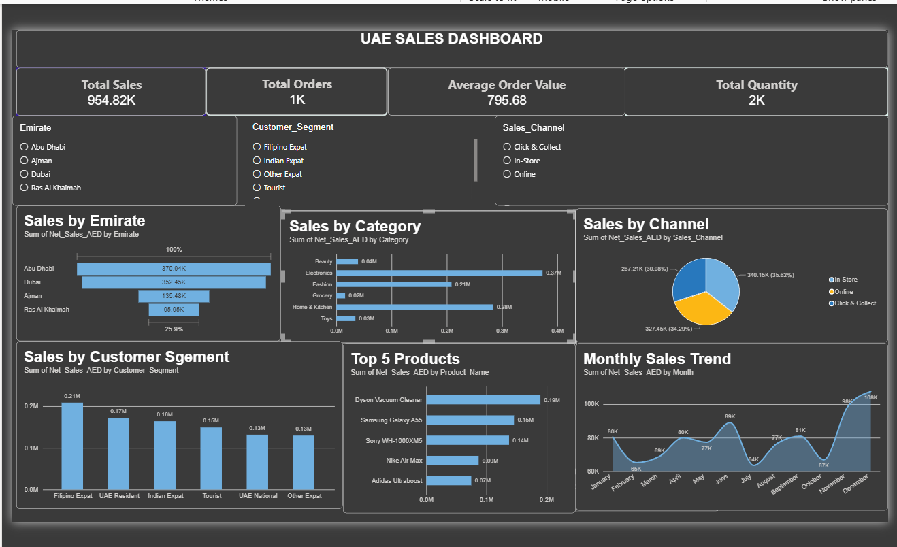

# UAE-Sales-PowerBI-Dashboard
Interactive UAE Sales Dashboard built with Power BI for sales performance analysis.
# UAE Sales Power BI Dashboard

## 📊 Project Overview

An interactive Power BI dashboard developed to analyze UAE sales performance and provide actionable business insights.

The dashboard allows users to explore sales performance across Emirates, product categories, sales channels, customer segments, and monthly trends.

## 🛠️ Tools & Skills

- Power BI
- Power Query
- DAX
- Data Cleaning
- Data Transformation
- Data Visualization
- Interactive Slicers
- KPI Analysis

## 📈 Key KPIs

- **Total Sales:** AED 954,821.08
- **Total Orders:** 1,200
- **Average Order Value:** AED 795.68
- **Total Quantity:** Available in dashboard

## 📌 Dashboard Analysis

The dashboard includes:

- Sales by Emirate
- Sales by Category
- Sales by Sales Channel
- Sales by Customer Segment
- Top 5 Products
- Monthly Sales Trend
- Interactive filters for Emirate, Customer Segment, and Sales Channel

## 🧹 Data Preparation

The dataset was cleaned and transformed using Power Query.

- 1,200 sales transactions
- 22 columns
- Duplicate Order IDs checked
- Blank rows removed
- Data types standardized
- Data prepared for analysis

## 📷 Dashboard Preview

## 🎯 Project Objective

The objective of this project is to demonstrate practical skills in data cleaning, business intelligence, DAX calculations, dashboard development, and interactive data visualization using Power BI.

## 👩‍💻 Created By

**Surya Raja**

Aspiring Data Analyst | Power BI | SQL | Excel | Python
